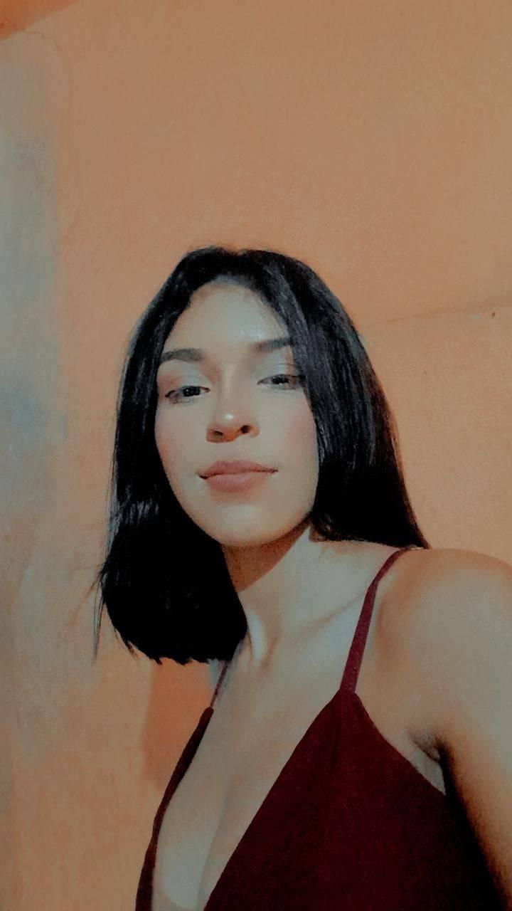

# Meu perfil
{width=3%}  
**Nome:** Claudiane Pereira  
**Idade:** 18  
**Sexo:** Femenino  
**Nascionalidade:** Brasileira  
**Endereço:** Tv: Manoel Cayres, 211, Pajuçara  
**Email:** Claudianes2005@gmail.com  
**Telefone:** (93) 991742045
**Escolaridade:** Ensino Superior
**Curso** Engenharia de Aquicultura

Profissional comprometido, destaco-me pela comunicação eficaz, pensamento analítico e habilidade em trabalhar em equipe. Sou eficiente na gestão do tempo, garantindo resultados de alta qualidade. Além do ambiente profissional, minha paixão pela dança e leitura de livros de romance reflete meu compromisso com o crescimento holístico. Estou entusiasmado para contribuir ativamente em ambientes desafiadores e inovadores, alinhando minhas habilidades e paixões.  

# Currículo Lattes
Olá, sou Claudiane Pereira, uma entusiasta em formação na área acadêmica, atualmente cursando Engenharia de Aquicultura. Estou dedicando-me a aprimorar habilidades em Engenharia e Aquicultura, com destaque em trabalhar de forma colaborativa, evidenciando minha habilidade em equipes.
Além do meu envolvimento acadêmico, tenho uma paixão por [Destaque Alguma Paixão Pessoal, como Dança ou Leitura], que complementa meu crescimento pessoal e criatividade. Estou aberta a oportunidades que possam expandir meus horizontes e contribuir para meu desenvolvimento acadêmico e profissional. Convido você a explorar mais sobre minha jornada neste espaço. Estou ansiosa para futuras colaborações e aprendizados.  

Anteciosamente,  

[Currículo Lattes](https://www.lattes.cnpq.br/)  

# Rede social
minhas redes sociais. 

[fecebook](https://www.facebook.com/?locale=pt_BR)
{width=4%}

[Instagram](https://www.instagram.com/) {width=5%}

[Twitte](ttps://twitter.com/i/flow/login?input_flow_data=%7B"requested_variant"%3A"eyJsYW5nIjoicHQifQ%3D%3D"%7D)
{width=4%}

# Sobre  
**Equipe**  
**Orietador:**Carlos Zarzar  
**Monitores:**Daniel Pinto, Gabriel Rodrigues e Luan Patrick  
**Discente:**Claudiane Pereira  

**Objetivos**
O curso tem o intuito de ensinar os discentes da universidade Federal do Oeste do Pará (Ufopa) *Campus* Monte Alegre a liguagem de programação. Eles irão aprender a utilizar os programas de versionamneto Git e GitHub, construir roteiros no RMarkdown, criar Dashboards Interativo e aplicativos no R Shiny.
Esse projeto servirá para ajudar em disciplinas que envolveram a utilização do programa R, em trabalhos acadêmicos e no enriquecimento do conhecimento em programação muito exigido no mercado de trabalho.
